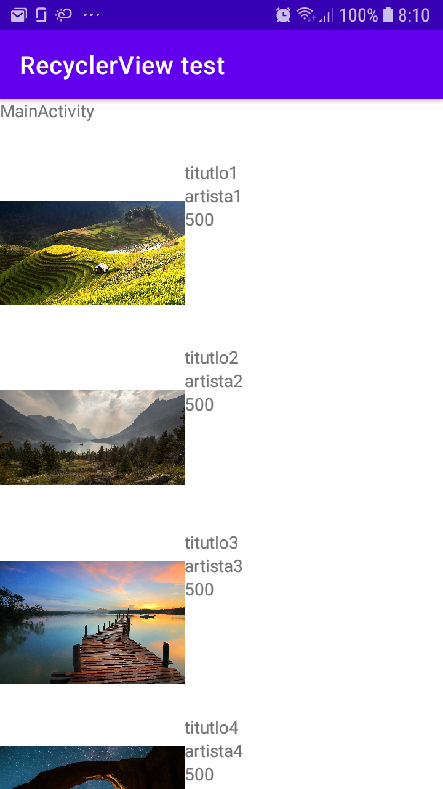

# Android recyclerview & view binding test with kotlin

Este proyecto tan solo muestra como crear el adaptador del recyclerView ya que el propio recyclerview es una etique que se muestra en el layout/main.xml.
Los datos son metidos al adapter con una lista de objetos de data class.

https://developer.android.com/guide/topics/ui/layout/recyclerview

